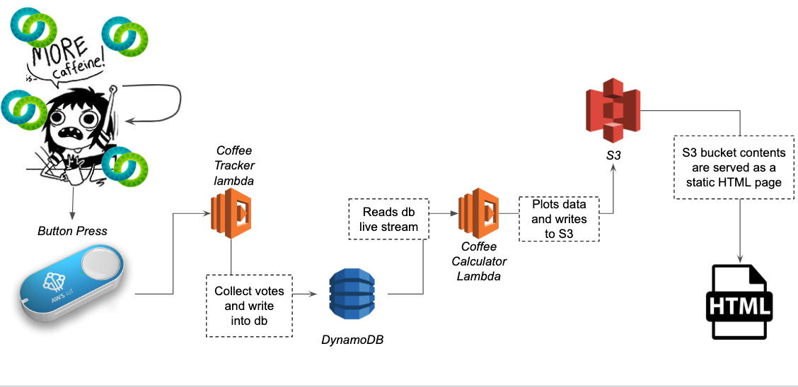
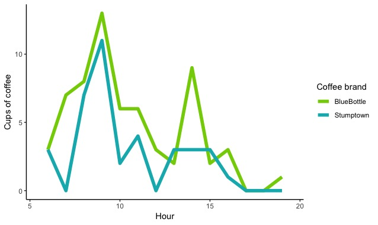
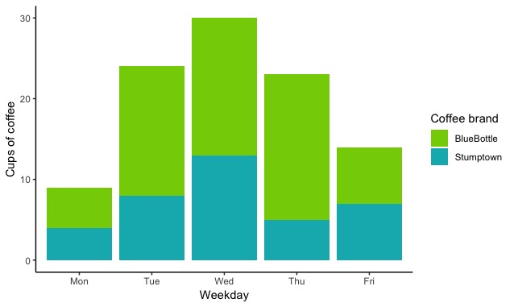

# CoffeeTracker
Analysing my co-workers' coffee consumption!

## Context
As part of Second Genome's 2018 Hackathon, this project was developped in a day to track coffee consumption in the Second Genome office. 

## Purpose 
Absolutely none.

## Architecture
The goal was to design a system to visualize Second Genome’s coffee consumption in real time.

* The SG coffee machine offers two choices of coffee beans: BlueBottle or Stumptown brand
* Coffee drinkers vote by pressing one of two programmable AWS IoT "dash" buttons.
* A button press triggers the _Coffee Tracker Lambda_ which collects the votes and sends them for storage in a dynamoDB table
* A second lambda, the _Coffee Calculator Lambda_ is listening to the dynamo table stream and aggregates new votes to the dataset and plots them
* The plots are then sent to S3 where a static HTML page is generated and served as a webpage.
* Display the results on office screens!

